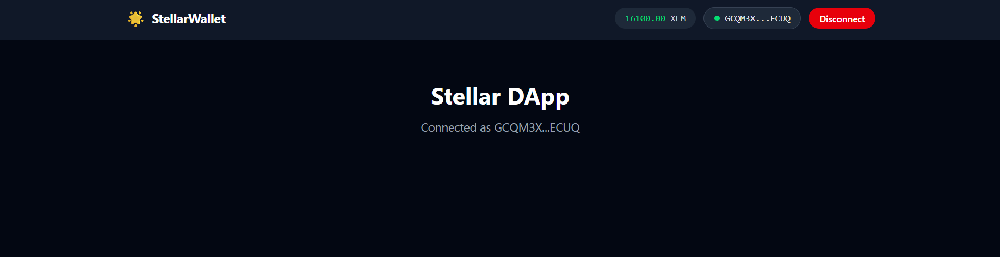
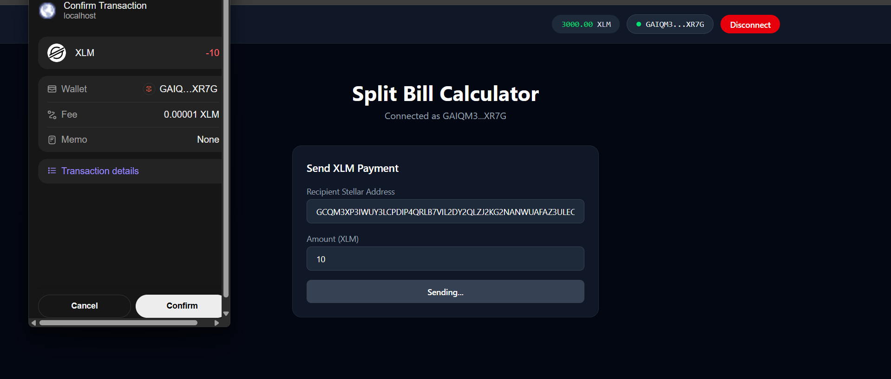
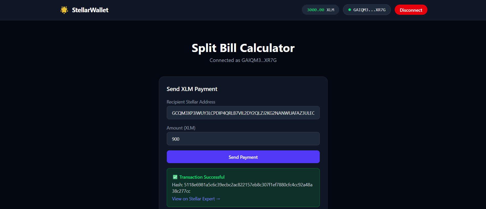
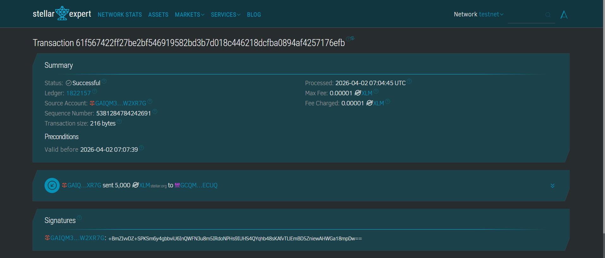

# Split Bill Calculator — Stellar Testnet DApp

A Level 1 Stellar DApp that lets you connect your Freighter wallet, view your XLM balance, and split a bill by sending XLM payments to multiple recipients on the Stellar Testnet.

---

## Features

- Connect / disconnect Freighter wallet
- Display XLM balance from Stellar Testnet
- Enter a total bill amount and recipient Stellar addresses
- Automatically calculates equal split per person
- Sends a multi-operation XLM transaction via Freighter
- Shows transaction hash with a link to Stellar Expert explorer

---

## Setup Instructions

### Prerequisites

- [Node.js](https://nodejs.org/) v18+
- [Freighter Wallet](https://freighter.app/) browser extension installed and set to **Testnet**

### Install and Run

```bash
# Clone the repo
git clone <your-repo-url>
cd steller

# Install dependencies
npm install

# Start the dev server
npm run dev
```

Open [http://localhost:5173](http://localhost:5173) in your browser.

### Fund Your Testnet Wallet

Use Stellar Friendbot to get free testnet XLM:

```
https://friendbot.stellar.org?addr=YOUR_PUBLIC_KEY
```

---

## Screenshots

### Wallet Connected + Balance Displayed
> Freighter connected — wallet address shown with XLM balance in the navbar.



### Freighter Transaction Confirmation
> Freighter popup asking the user to confirm the XLM payment — shows wallet, fee (0.00001 XLM), and transaction details before signing.



### Transaction Successful Result
> Success banner showing transaction hash with a direct link to Stellar Expert explorer.



### Transaction on Stellar Expert
> Transaction confirmed on Stellar Testnet — viewable on Stellar Expert explorer with full details.



---

## Tech Stack

- [React](https://react.dev/) + [Vite](https://vitejs.dev/)
- [Tailwind CSS](https://tailwindcss.com/)
- [@stellar/freighter-api](https://www.npmjs.com/package/@stellar/freighter-api)
- [@stellar/stellar-sdk](https://www.npmjs.com/package/@stellar/stellar-sdk)
- [Stellar Testnet Horizon](https://horizon-testnet.stellar.org)

---

## Network

This app runs on **Stellar Testnet**. Make sure your Freighter wallet is switched to Testnet before connecting.
